# 主数据平台

## 介绍
主数据平台（master-data-platform），简称MDP。MDP基于Java17、SpringBoot、vue3、ant-design-vue等主流技术构建的中后台快速开发平台，立志打造为一个企业级的软件开发基础脚手架，帮助企业快速搭建一个基础开发框架。

简单来说，可以理解为MDP是集 单点登录系统、主数据（基础数据）维护与管理、开发者平台（开放平台）等功能于一身的平台。

该项目主要功能包含：基础数据管理、权限管理、用户身份认证、应用（子系统）集成。

- 基础数据管理
  - 组织机构管理、岗位管理、用户管理
  - 钉钉等三方数据同步
  - 菜单管理、角色模板管理、角色管理
  - 字典管理、配置管理
- 权限管理
  - 应用权限管控
  - 菜单、按钮、数据、字段权限的配置、授权和鉴权
  - 接口权限的配置、授权和鉴权
- 用户身份认证
  - SSO、Oauth2等多种主流的单点登录协议。 
- 应用（子系统）集成
  - 接入与审批
  - 免密登录与一键跳转
  - 数据订阅与拉取
  - 接口调用与管控
  - SDK下载
  - 文档生成与查看
- 其他功能
  - 消息中心
  - 用户个人中心
  - 可视化代码生成
  - 短信、邮件、站内信功能
  - 文件存储
  - 登录日志、操作日志

## 联系作者
- 微信：hhenhen

## 内置应用

| 应用 （子系统）                   | 后端项目名            | 前端项目名    | 备注                             |
|--------------------------------| --------------------- | ------------- |--------------------------------|
| [工作台](http://workbench.mddata.top) | md-workbench，简称mdw | web-workbench | 可以理解为用户中心、用户的统一门户。通常提供给所有用户使用。 |
| [控制台](http://console.mddata.top) | md-console，简称mdc   | web-console   | 可以理解为后台管理项目，通常提供给管理员使用。        |
| [开发者平台](http://open.mddata.top) | md-open，简称mdo      | web-open      | 可以理解为开发者中心，通常提供给第三方开发者接入应用使用。  |

- 工作台：http://workbench.mddata.top
- 控制台：http://console.mddata.top
- 开发者平台：http://open.mddata.top
- 演示环境：
  - 运维管理员账号密码：ops_admin/admin
  - 开发者管理员账号密码：open_admin/admin
  - 企业管理员账号密码：admin/admin

## 主要功能

- 工作台

  提供给普通用户使用，作为普通用户的门户中心，方便用户管理个人信息、查看消息通知、免密登录其他应用。

  - 统一注册与登录：登录、注册、找回密码、第三方账号关联、第三方账号登录。
  - 个人中心：个人信息修改、头像修改。
  - 安全设置：账号密码修改、手机号修改、多因素登录、邮箱修改。
  - 登录日志：个人登录日志查询。
  - 我的应用：应用查询、应用免密登录、常用应用收藏。
  - 消息中心：查看平台的所有消息通知（包括子应用的消息）

- 控制台

  提供给管理员使用，管理员可以维护数据、分配权限、配置系统参数、应用后台创建和审核、应用接口管理、接口文档管理。

  - **主数据**维护：组织架构、岗位、人员、字典、应用菜单
  - 权限管理：用户访问系统权限、应用获取数据的接口权限、应用数据接口监控与限流。
  - 应用管理：应用查询、应用创建、应用审核、应用发布、接口管理、文档管理。
  - 系统配置：全局参数配置、短信模版、邮件模版、OSS存储配置。
  - 代码生成：可以生成基于本平台开发的子应用代码。

- 开发者平台

  提供给开发者使用，若你的平台希望将其他应用（系统）接入到平台，可以让开发者登录开发者平台申请开通应用。应用审批通过后，即可配置开发者秘钥，然后通过HTTP、SDK等方式获取平台数据、对接单点登录等。

  - 应用管理：申请应用、管理应用、设置应用的秘钥、应用权限申请、查看平台提供的接口文档。

  - 数据订阅（推数据）：应用订阅主数据后，**主数据**新增或变更可以推送事件给应用。

  - 接口调用（拉数据）：通过SDK或HTTP接口等方式调用平台提供的接口。

  - 文档查看：开发者可以查看平台发布的接口文档。

    

## 技术栈

- 后端： 
  - 基础：Java17、SpringBoot、Hutool、lombok、fastjson2、Jackson、fastexcel、JustAuth、Sa-Token、mapstruct
  - 数据库： MySQL 8.0.x、达梦
  - 缓存：Redis 
  - 文件存储：基于x-file-storage，支持 FastDFS 5.0.5/阿里云OSS/本地存储/MinIO/华为云/七牛云 任意切换
  - 短信：sms4j
  - 持久层框架： Mybatis-flex
  - 文档：knife4j、torna
  - 定时任务：power-job 
  - 代码生成器：自主开发 
- 部署： 
  - 服务器：CentOS、UOS
  - Openresty、Nginx 
  - Maven、Jenkins/阿里云效/Github Actions
  - Docker 
  - Kubernetes
- 前端 
  - 基于 vue-vben-admin 5.x 最新版框架二次开发，
  - Turbo Repo：规范且标准的大仓架构，使用pnpm+monorepo+turbo工程管理模式，提供企业级开发规范
  - vue3
  - ant-design-vue、Shadcn-UI
  - vxe-table
  - vite
  - typescript
  - vue-router
  - Pinia
  - Axios
  - Dayjs 

## 项目预览
### 工作台
- 我的应用
  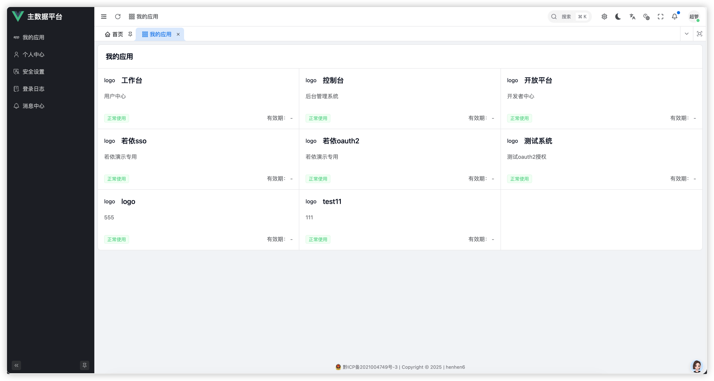
- 个人中心
- 消息中心
- 登录日志
- 安全设置

### 控制台
- 组织管理
    
- 岗位管理
  
- 用户管理
  - 
  - 
- 菜单管理
  - 
  - 
- 角色模板管理
  - 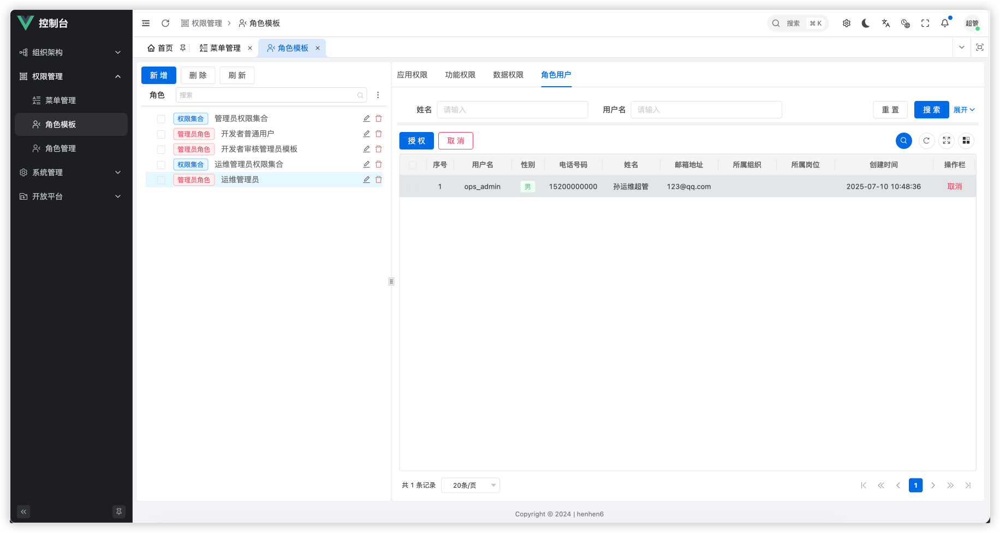
  - 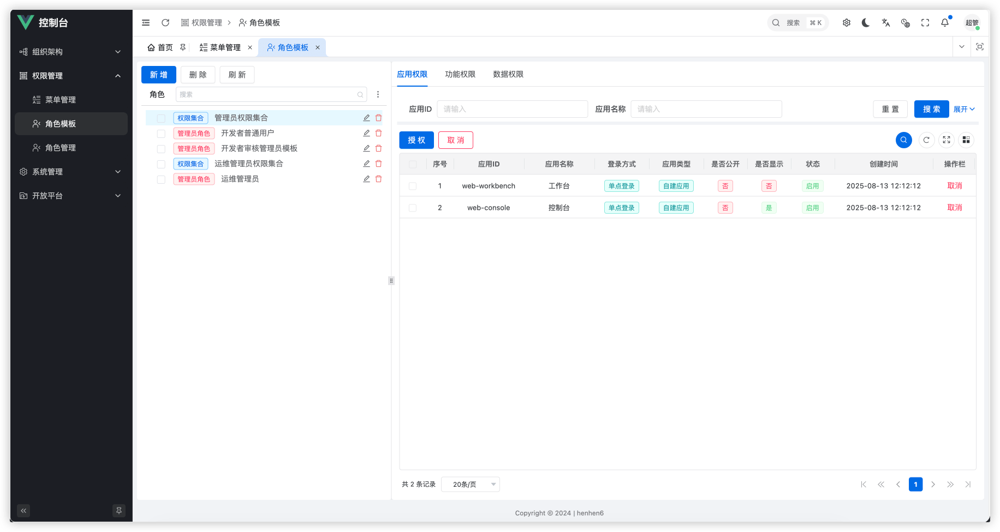
  - 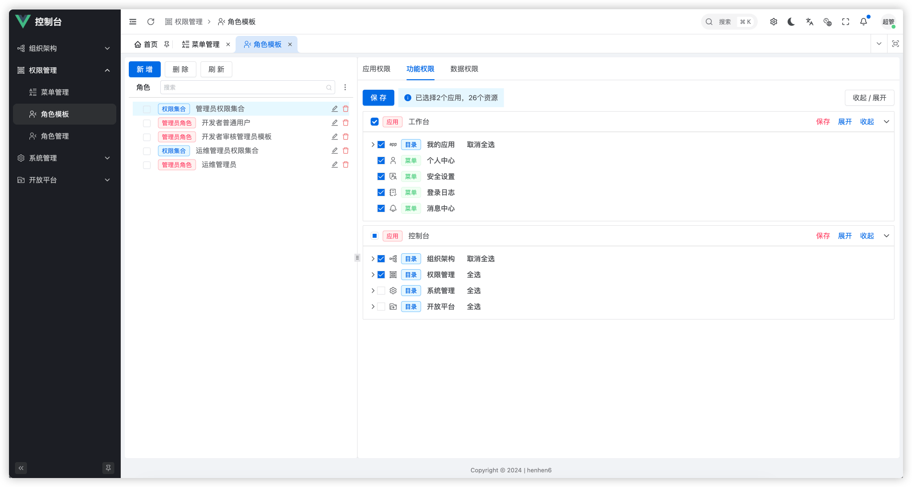
- 角色管理
  - 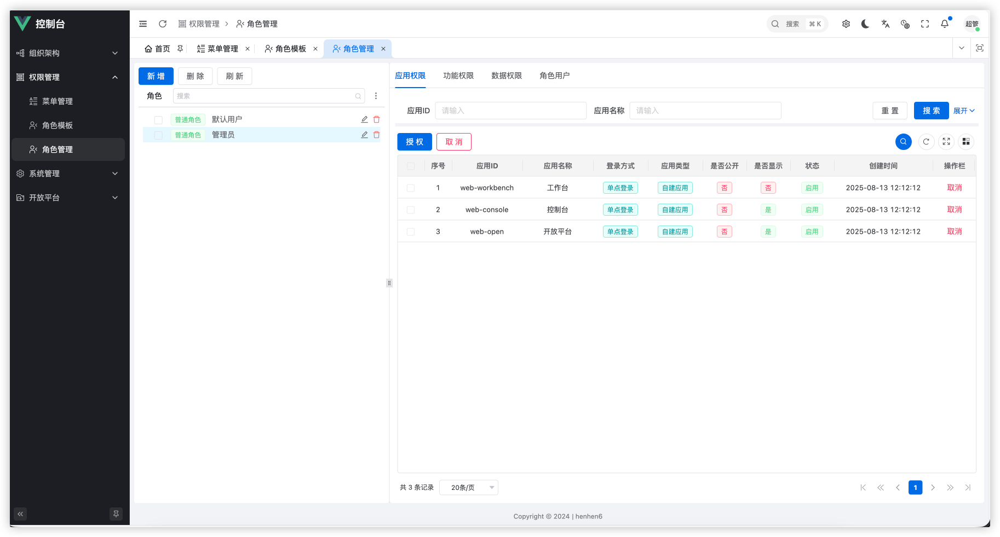
- 字典管理
  - 
  - 
  - 
- 系统配置
  - 
- 应用管理
  - 
  - 
  - 
- 应用审核
  
- 开放接口
  
- 开放文档
  
- 权限组
  
- Oauth2权限
  

### 开发者平台
- 首页
  - 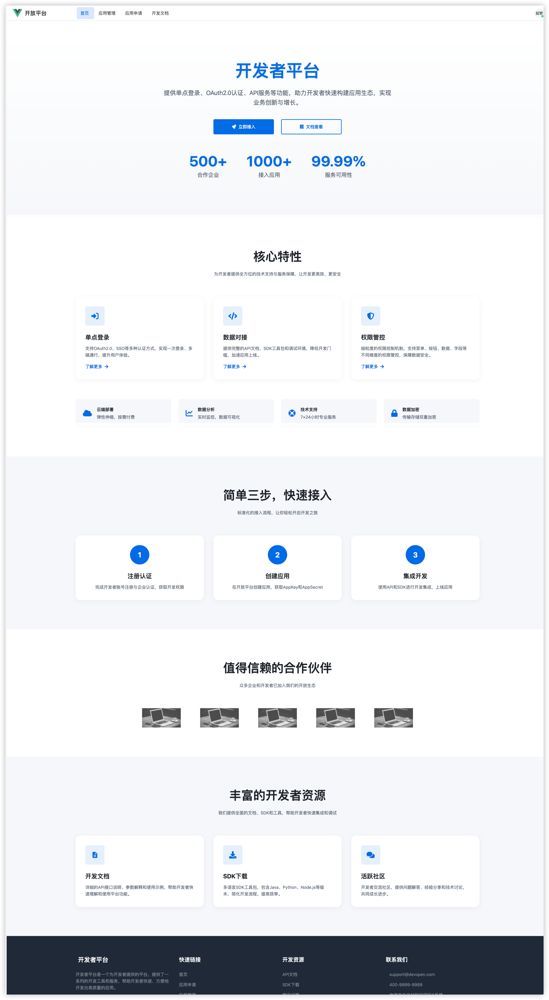
- 应用申请
  - 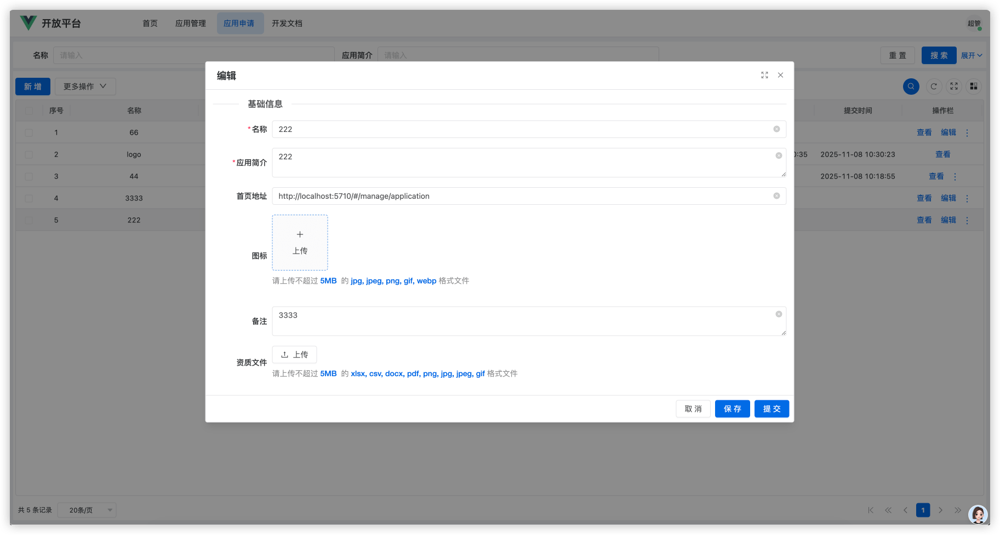
  - 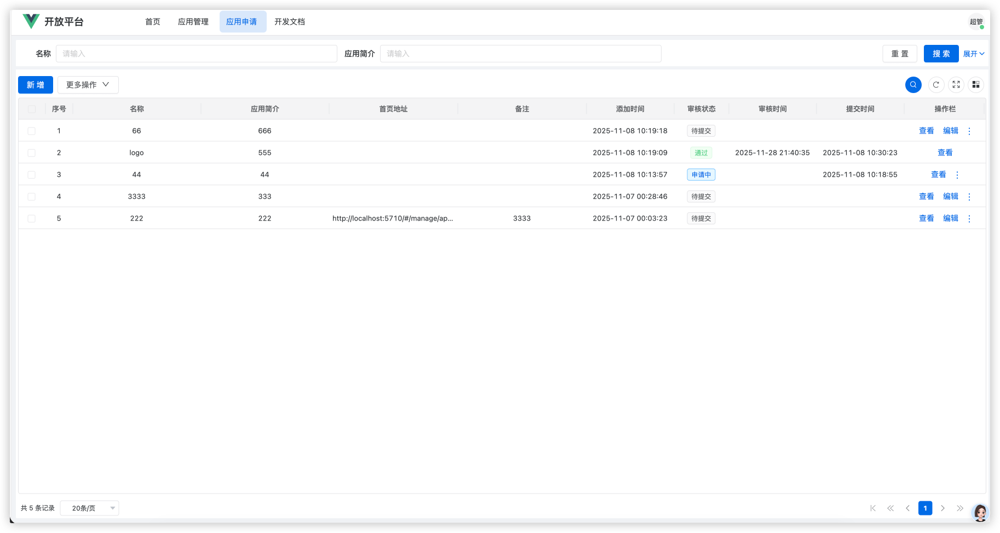
- 应用管理
  - 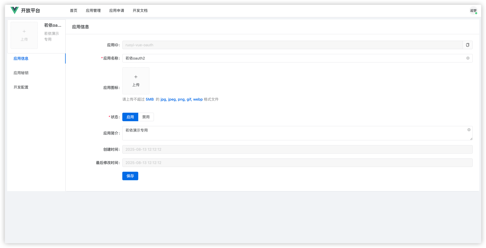
  - 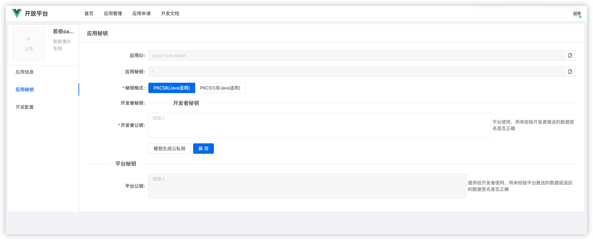
  - 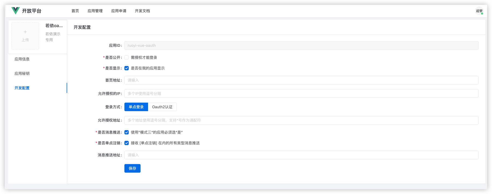
- 开发文档
  - 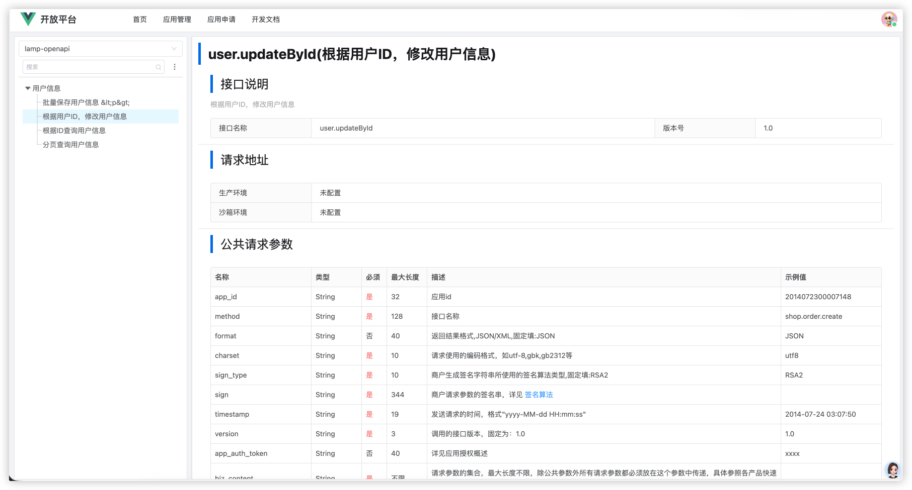
