# 主数据平台

## 介绍
主数据平台，英文名master-data-platform，简称MDP。 主要为了解决 用户身份认证、用户访问子应用、子应用接入与审批、基础数据管理等。

MDP支持SSO、Oauth2等多种主流的单点登录协议。

说直白一点，MDP是一个单点登录主系统、主数据维护与管理系统、开放平台，基于MDP，可以让你的项目快速开发新的应用，对接已经运行很久的老应用。

## 内置应用（内置子系统）

| 应用名 （子系统名） | 后端项目名            | 前端项目名    | 备注                                                         |
| ----------------------- | --------------------- | ------------- | ------------------------------------------------------------ |
| 工作台                  | md-workbench，简称mdw | web-workbench | 可以理解为用户中心、用户门户。通常提供给普通用户使用。       |
| 控制台                  | md-console，简称mdc   | web-console   | 可以理解为后台管理项目，通常提供给管理员使用。               |
| 开放平台                | md-open，简称mdo      | web-open      | 可以理解为开发者中心，通常提供给想要将应用接入本平台的第三方开发者使用。 |

## 主要功能

- 工作台

  提供给普通用户使用，作为普通用户的门户中心，方便用户管理个人信息、查看消息通知、免密登录其他子应用。

  - 统一注册与登录：登录、注册、找回密码、第三方账号关联、第三方账号登录。
  - 个人中心：个人信息修改、账号密码修改、手机号修改、多因素登录、邮箱修改、头像修改、个人登录日志查询。
  - 我的应用：应用查询、应用免密登录、常用应用收藏。
  - 消息中心：查看平台的所有消息通知（包括子应用的消息）

- 控制台

  提供给管理员使用，管理员可以维护数据、分配权限、配置系统参数、应用后台创建和审核、应用接口管理、接口文档管理。

  - **主数据**维护：组织架构、岗位、人员、字典、应用菜单
  - 权限管理：用户访问系统权限、应用获取数据的接口权限、应用数据接口监控与限流。
  - 代码生成：可以生成基于本平台开发的子应用代码。
  - 系统配置：全局参数配置、短信模版、邮件模版、OSS存储配置。

- 开放平台

  提供给开发者使用，若你的平台希望将其他应用（系统）接入进来，可以让开发者登录开发者中心申请创建应用。应用审批通过后，即可配置开发者秘钥，然后通过SDK等方式获取平台数据、对接单点登录等。

  - 应用管理：申请应用、管理应用、设置应用的秘钥、应用权限申请、查看平台提供的接口文档。

  - 数据订阅（推数据）：应用订阅主数据后，**主数据**新增或变更可以推送事件给应用。

  - 接口调用（拉数据）：通过SDK或HTTP接口等方式调用平台提供的接口。

  - 文档查看：开发者可以查看平台发布的接口文档。

    

## 技术栈

- 开发方面： 
  - 基础：Java17、 SpringBoot、Hutool、lombok、fastjson2、Jackson、fastexcel、JustAuth、Sa-Token 
  - 缓存：Redis 
  - 数据库： MySQL 8.0.x、达梦
  - 定时任务：power-job 
  - 持久层框架： Mybatis-flex
  - 代码生成器：自主开发 
  - 文档：swagger、knife4j、torna
  - 项目构建：Maven 
  - 短信：sms4j
  - 文件存储：基于x-file-storage，支持 FastDFS 5.0.5/阿里云OSS/本地存储/MinIO/华为云/七牛云 任意切换
- 部署方面： 
  - 服务器：CentOS 
  - Openresty、Nginx 
  - Jenkins 
  - Docker 
  - Kubernetes
- 前端 
  - 基于 vue-vben-admin 5.x 最新版框架二次开发。
  - vue3
  - typescript
  - ant-design-vue
  - vite
  - vue-router
  - Pinia
  - vxe-table
  - Axios
  - Dayjs 
  - codemirror

## 项目预览
- 组织管理
  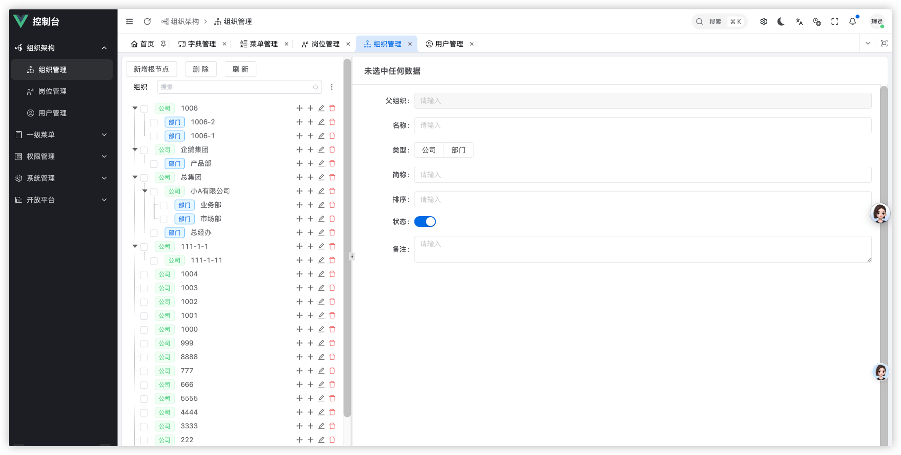
- 岗位管理
  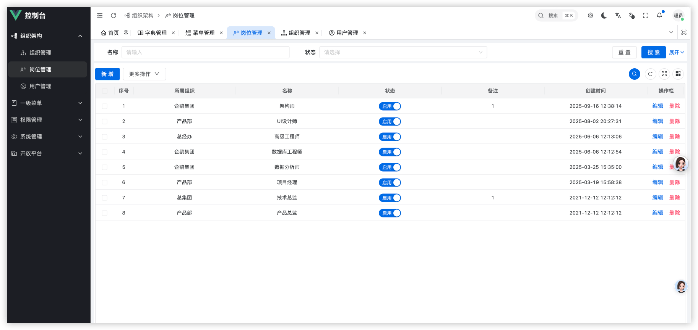
- 用户管理
  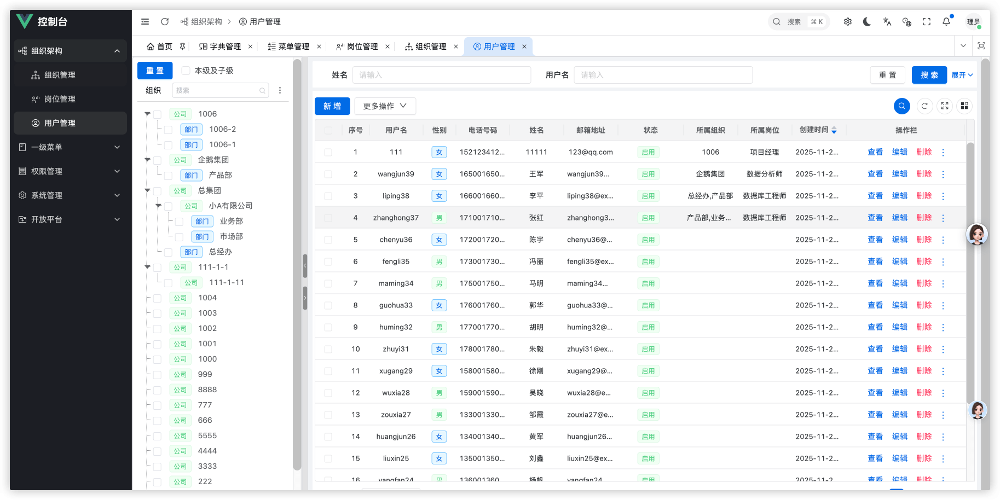
- 用户新增
  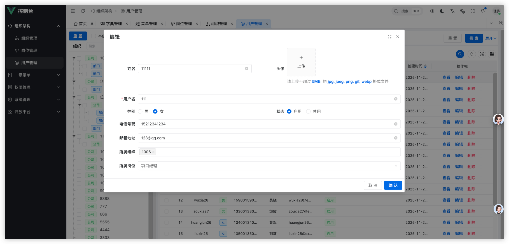
- 菜单管理
  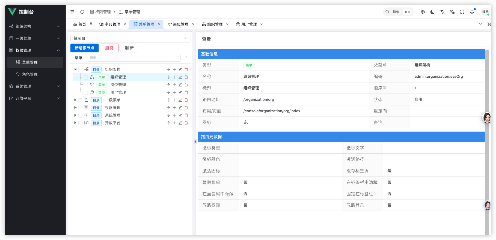
- 菜单新增
  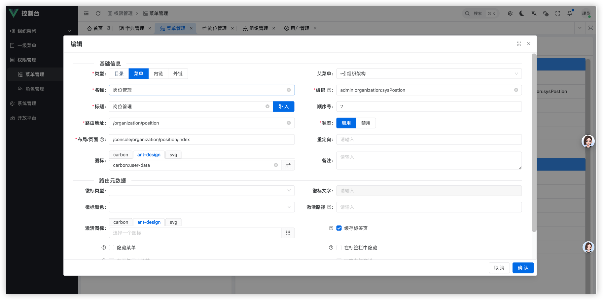
- 字典管理
  - 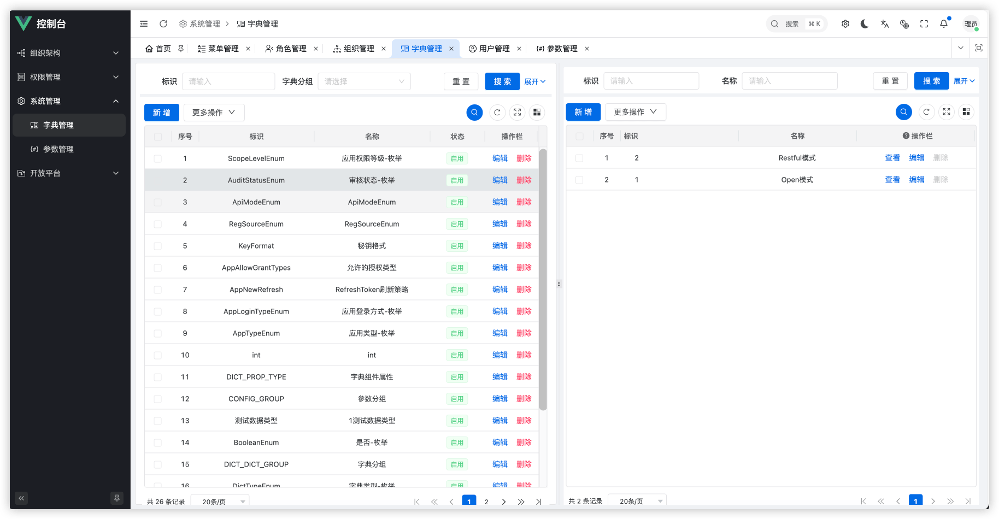
  - 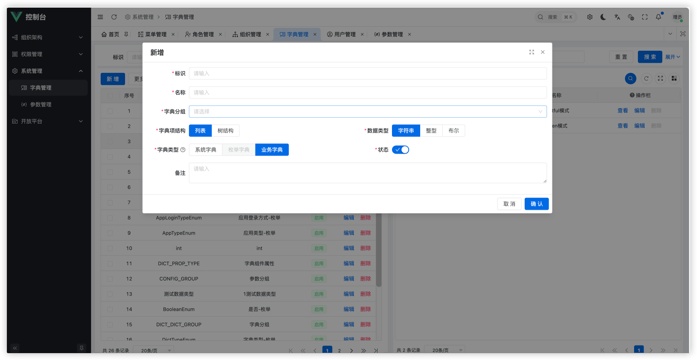
  - 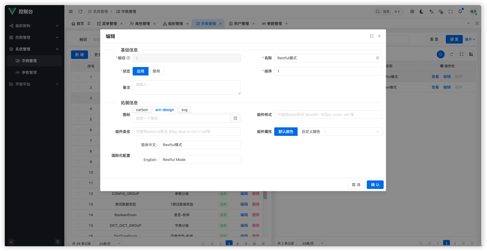
- 系统配置
  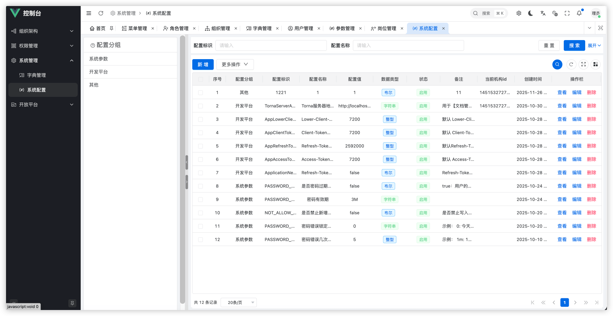
- 应用管理
  - 
  - 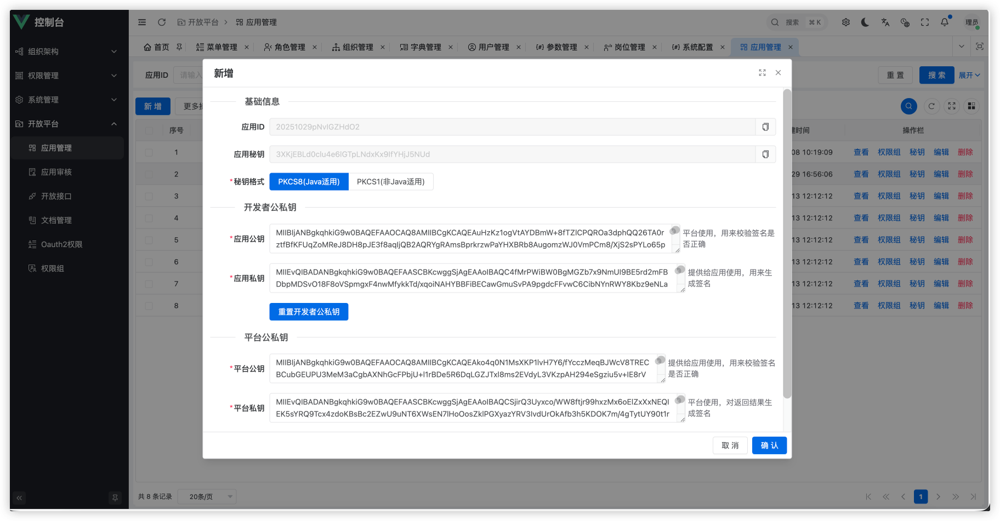
  - 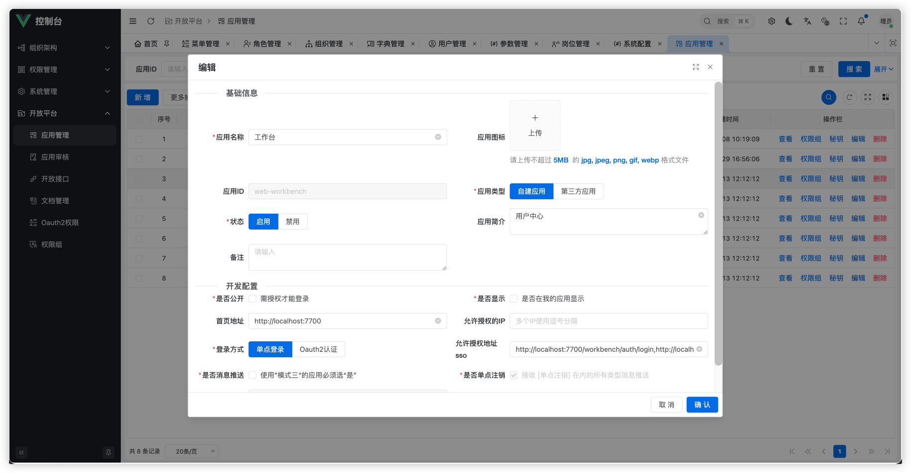
- 应用审核
  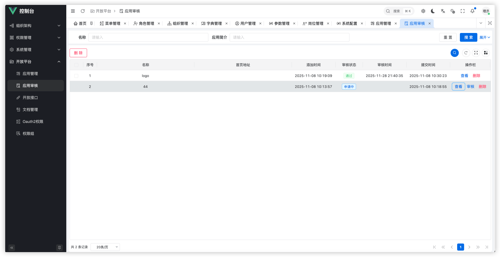
- 开放接口
  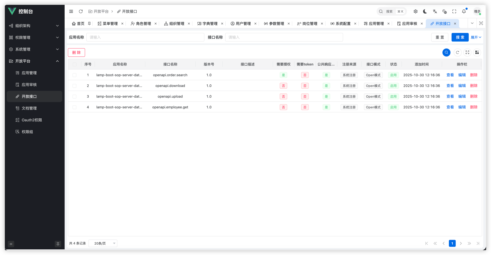
- 开放文档
  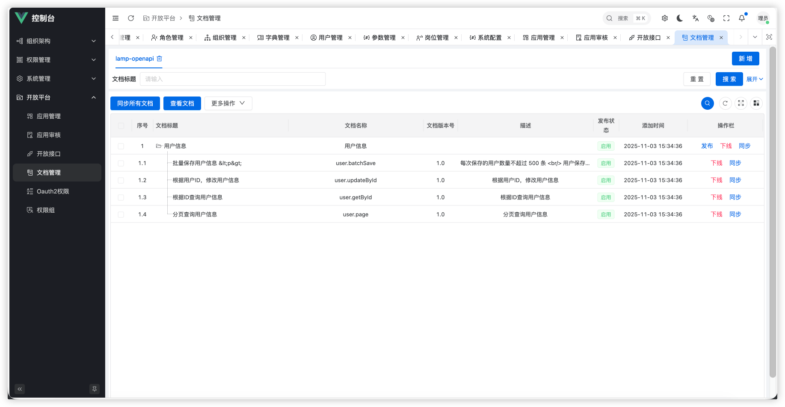
- 权限组
  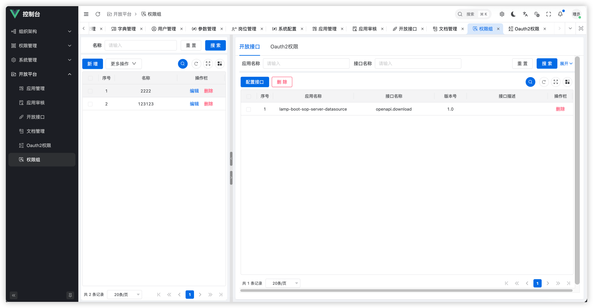
- Oauth2权限
  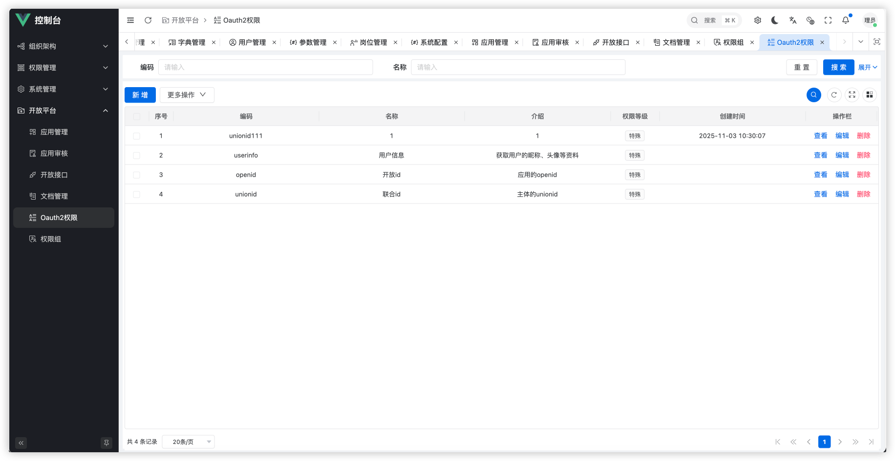